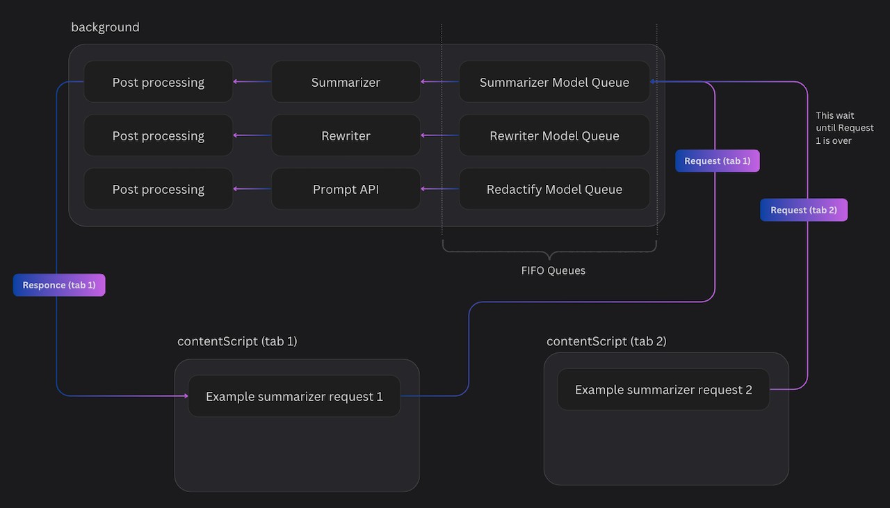

# Chrome Built-in AI Challenge (IntelliWrite)

## Architecture (model behavior)

Following image shows how the model works in the background. There are three queues for each model works in First-In-First-Out (FIFO) order.


## Installing

1. Clone the repository
2. Check if your `Node.js` version is >= **21**.
3. Run `npm install` to install the dependencies.
4. Run `npm run dev` to run the application in dev mode

### Chrome Extension Developer Mode

1. set your Chrome browser 'Developer mode' up
2. click 'Load unpacked', and select `chrome-built-in-ai-challenge/build` folder

## Packing

After the development of your extension run the command

```shell
$ npm run build
```

Now, the content of `build` folder will be the extension ready to be submitted to the Chrome Web Store. Just take a look at the [official guide](https://developer.chrome.com/webstore/publish) to more infos about publishing.
